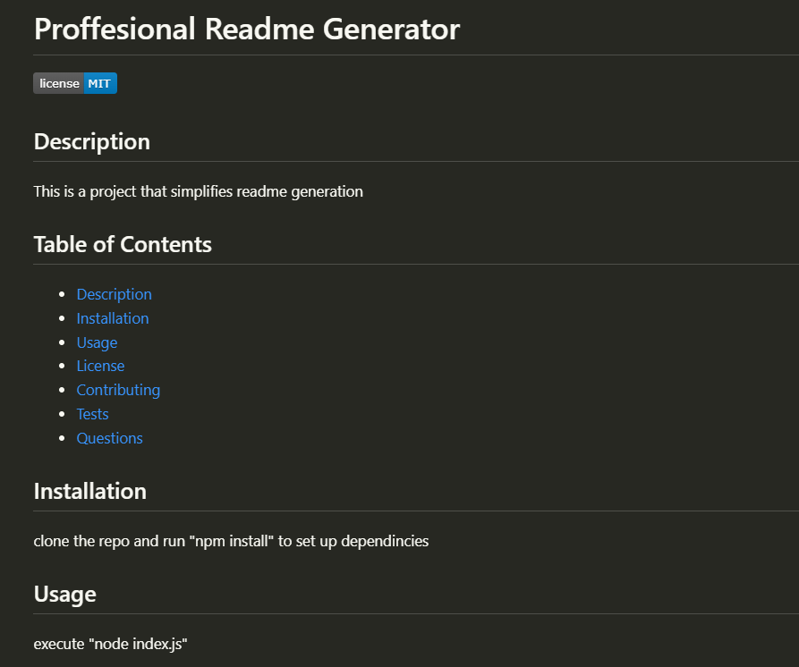
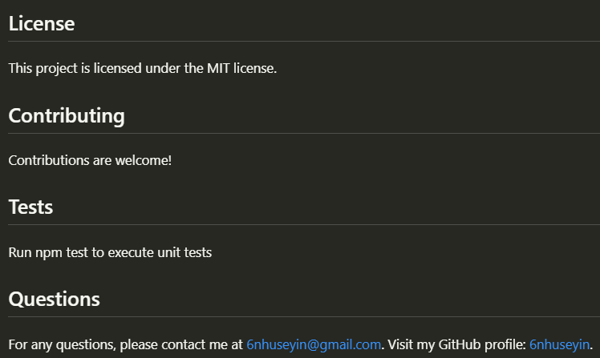
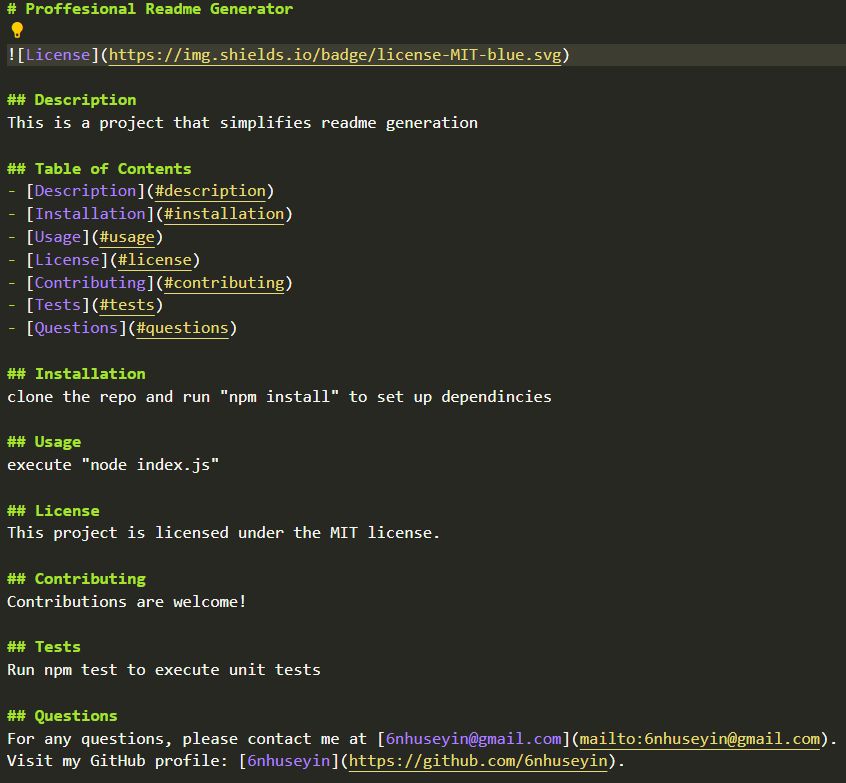

# Professional-readme-generator

A command-line application that generates a professional README.md file from user input. This tool streamlines the process of setting up a well-documented GitHub repository, allowing developers to focus more on their projects. Built with Node.js and the Inquirer package, it offers a simple yet effective way to generate comprehensive README files.

## Key Features

Inquirer Package: Utilizes the Inquirer package for collecting user input via the command line.
Node.js: Built on Node.js, ensuring a seamless command-line experience.

## Links

Here you can find a short video explaining the how the program:
```https://drive.google.com/file/d/1iAFWdYvk7BXtPIaNwGj7g5xD7h4f0vnB/view?usp=drive_link```

Here is the GitHub repository: ```https://github.com/6nhuseyin/professional-readme-generator```

## Installation

Clone the repository: 
```https://github.com/6nhuseyin/professional-readme-generator```

Navigate to Project Directory: ```cd professional-readme-generator```

Install Dependencies: ```npm install```

Run the Application: ```node index.js```

Follow Prompts: Answer the prompts to provide information about the project

README Generation: When all prompts are answered, the program will  generate a TestREADME.md file in the project root directory based on your inputs.

## Usage







## Contributing

Contributions to the README Generator are welcome. Please fork the repository, make your changes, and submit a pull request for review.

## Future Improvements: Tests

The README Generator project plans to implement automated testing in the future to enhance reliability and maintainability. It will be possible to run npm test to execute the unit tests, ensuring the application functions as expected.

## Questions

For any questions or feedback, please reach out to myemail@example.com. Visit my GitHub profile for more projects.
